# Palseek

Создано 4 страницы и настроена маршрутизация

| Страница | Маршрут |
|-|-|
| Авторизация | [my.domain/auth](http://79.164.43.106:2000/auth) |
| Поиск | [my.domain/search](http://79.164.43.106:2000/search) |
| Профиль | [my.domain/profile](http://79.164.43.106:2000/profile) |
| 404 | [my.domain/asf](http://79.164.43.106:2000/asf) |

---

## Описание страниц

### Страница авторизации

Реализовано:
- Обязательное заполнение всех полей
- Проверка ввода корректного email (латинские буквы, цифры и @)
- Проверка совпадения паролей

| 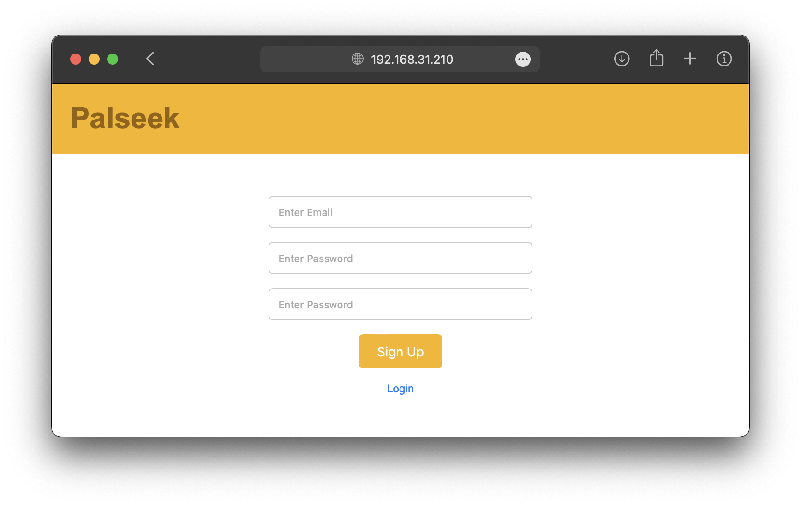 | 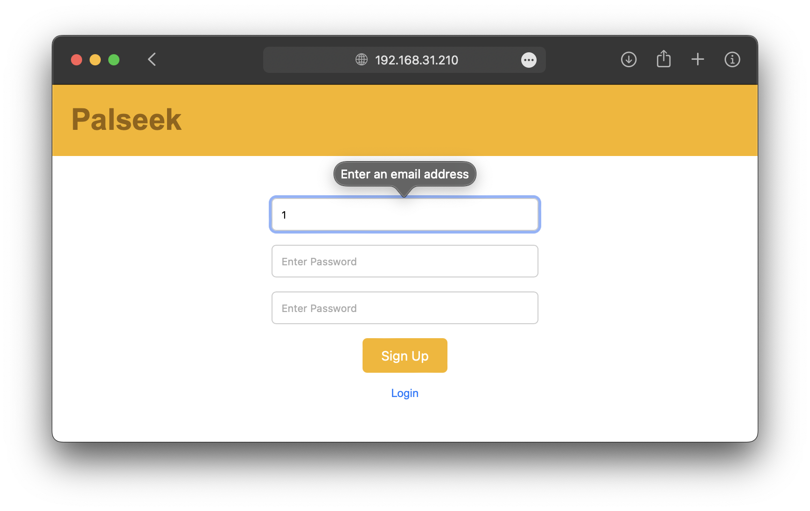 |
|-|-|
| 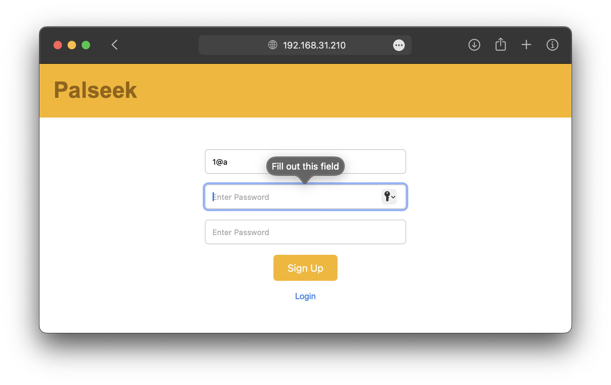 | 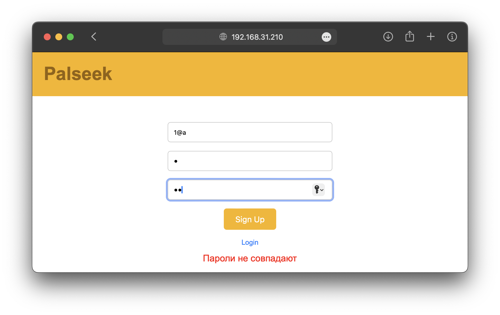 |

| 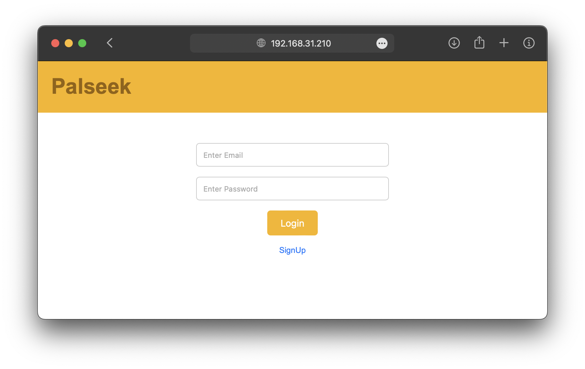 | 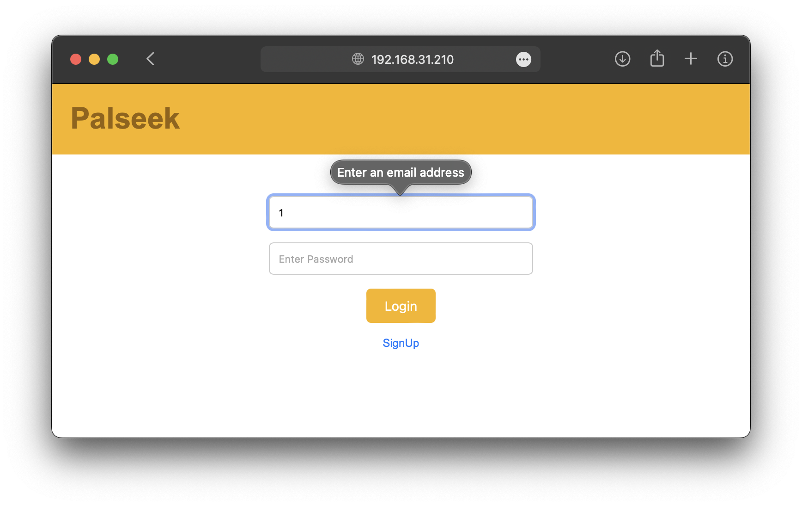 | 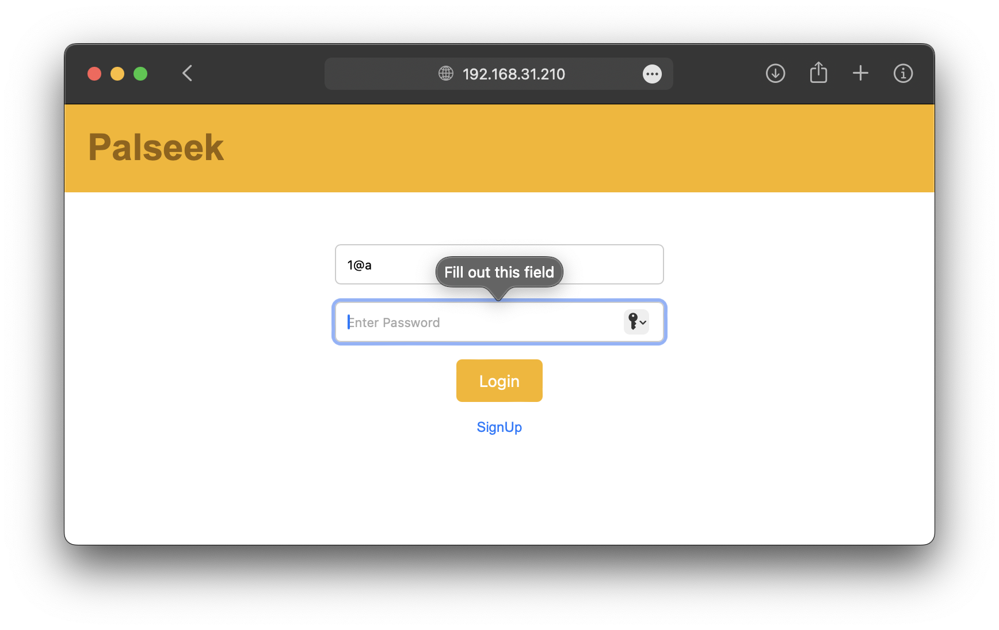 |
|-|-|-|

### Страница поиска

Реализовано:
- Подтягивание записей о пользоветелях (имитация работы базы данных через [JS скрипт](./search/search.js#L9-L16))
- Адаптивный дизайн для разных типов экранов
- Динамическое изменение сетки в зависимости от ширины экрана

| 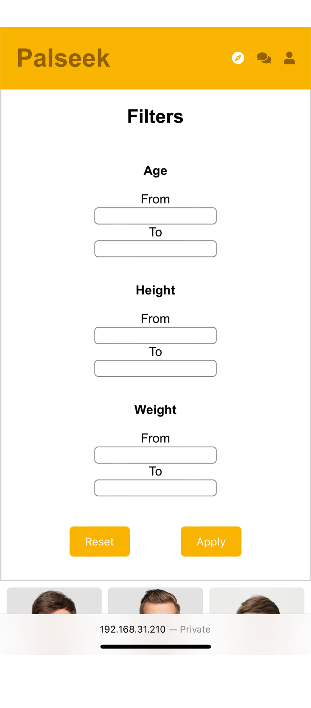| 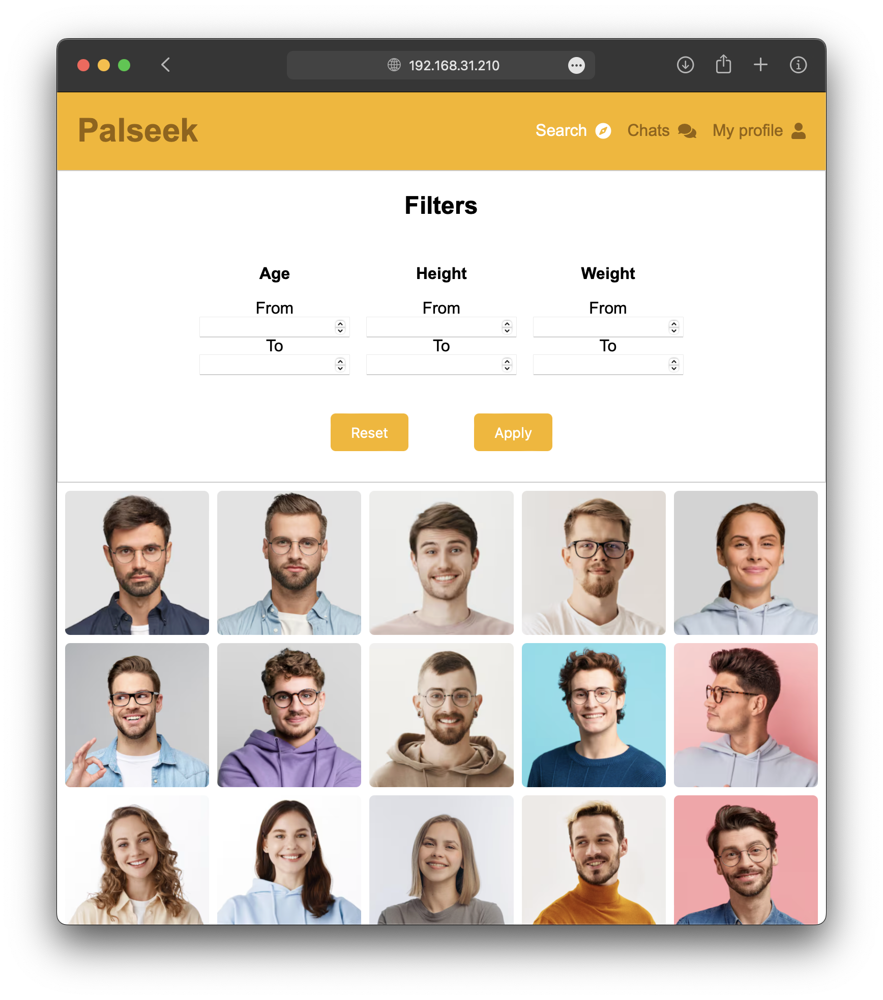 | 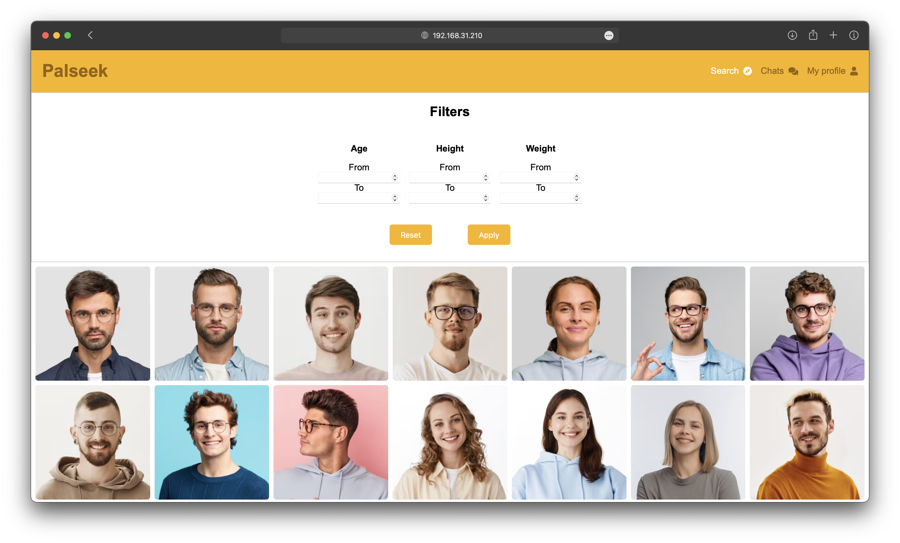 |
|-|-|-|

### Страница поиска

Реализовано:
- Адаптивный дизайн для разных типов экранов
- Центрирование по середине

| 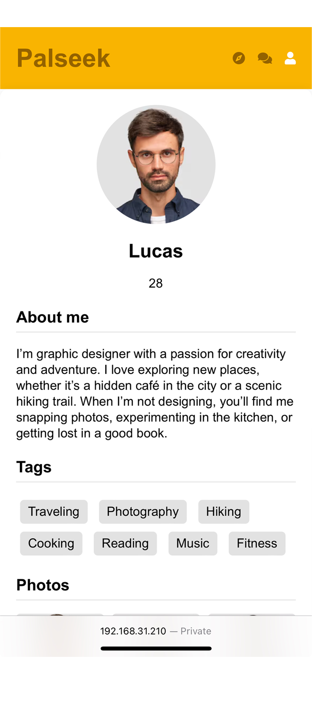| 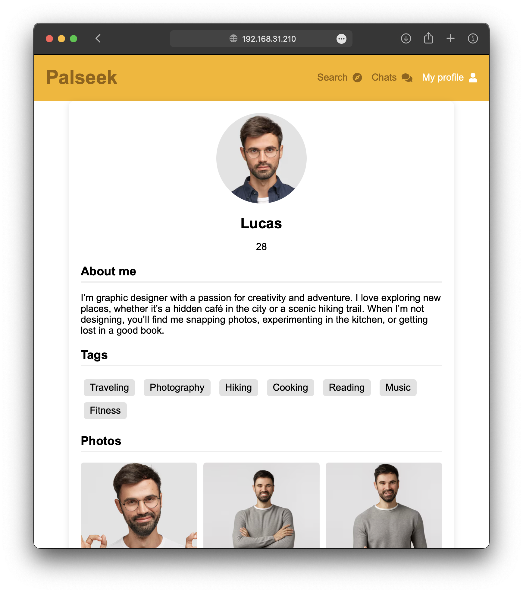 | 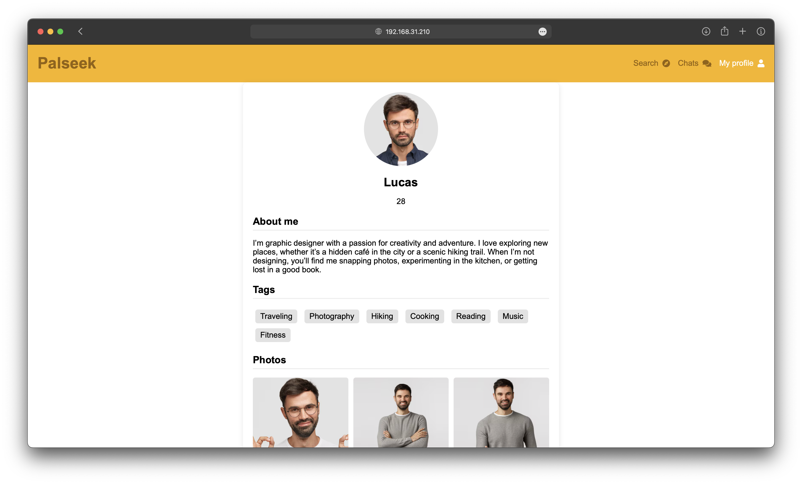 |
|-|-|-|

### Страница 404

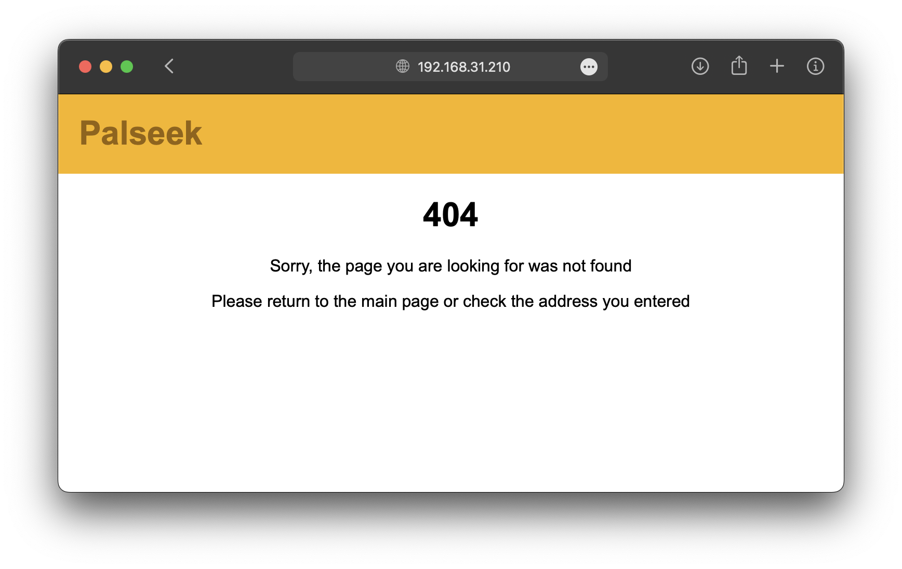